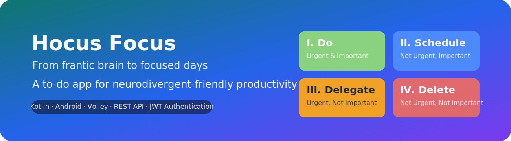

# Hocus Focus – An Android To-Do App (Kotlin + Volley + REST API + JWT Authentication) by Celia Ho & Rider Barnes

Hocus Focus is an Android productivity app based on the Eisenhower Matrix (Do / Schedule / Delegate / Delete), a simple but powerful framework that turns overwhelming to-do lists into four clear priority buckets. The app is designed with neurodivergent and ADHD users in mind, as well as anyone looking for a lightweight, visually intuitive system for managing tasks.

Users can create accounts, log in, reset passwords via OTP, and manage tasks across four quadrants with full backend persistence. All data is saved to a locally running REST API powered by **DocServer**, an educational server created by Professor Harris Williams for Bunker Hill Community College’s CSC-244 Android Development course. This app was our final project for CSC-244 in Spring 2025.

This repository contains:  
- full Android source code (Kotlin)  
- project deliverables (user flow diagram, authentication mockups, prototype video, final demo video)  
- instructions for running the app locally using the DocServer backend 

## 👥 Project Roles

**Celia Ho – Project Manager, Lead Developer, Product & Accessibility Designer**  
Product direction and feature scoping; UI/UX flow architecture; color palette creation; accessibility design; authentication screen design; Kotlin development; testing and debugging; final app demo production; documentation.

**Rider Barnes – UI/UX Designer & Prototype Developer**  
Task screen design; clickable prototype creation and video; UI/UX design support; Kotlin development; testing and debugging; final app demo production.

---

## 📁 Project Deliverables

These files and artifacts are available inside `Project Requirements & Deliverables/` or linked here for convenience:
- [User Flow Diagram](https://github.com/celiaho/HocusFocusToDo/blob/main/Project%20Requirements%20%26%20Deliverables/Hocus%20Focus%20User%20Flow%20Diagram.png)
- [Authentication Screens Mockups](https://github.com/celiaho/HocusFocusToDo/blob/main/Project%20Requirements%20%26%20Deliverables/Auth%20Screens%20Mockups.png)
- [Prototype Recording](https://streamable.com/7ptdb6)
- [App Demo Recording](https://streamable.com/uzeo97) 

### 🧪 Demo Flow
1. Launch app → splash screen  
2. Sign up for a new account  
3. Auto-login after signup  
4. First document auto-created  
5. Add tasks to all four quadrants  
6. Toggle completion  
7. Delete tasks  
8. Close app → reopen → tasks persist  
9. Log out  
10. Use Forgot Password → OTP → Reset Password  

---

## ✨ Features

### 🔐 Authentication
- Signup, login, and OTP-based password reset  
- Client-side JWT decoding + expiration checking  
- Auto-routing via Splash screen based on token state  
- Session persistence through SharedPreferences  

### 🗂 Task Management (Eisenhower Matrix)
Each user has one persistent "task document" containing four quadrants:
- **Q1:** Urgent & Important (Do)
- **Q2:** Not Urgent & Important (Schedule)
- **Q3:** Urgent & Not Important (Delegate)
- **Q4:** Not Urgent & Not Important (Delete)

Users can:
- add tasks directly to each quadrant 
- mark tasks complete/incomplete  
- delete tasks

The app:
- auto-creates the first document for new users
- autosaves to server whenever changes occur

### 🎨 UI / UX & Accessibility
- Custom XML layouts (no Jetpack Compose)
- Custom typography, theme system, and color palette
- High contrast color palette aligned with WCAG visibility expectations
- Large 48dp+ Material touch targets for easy tap accuracy 
- Keyboard-aware scrolling across auth screens
- Minimal motion, low-cognitive-load design
- Layout compatible with screen magnification and reduced-vision settings
- Intuitive 4-quadrant scrollable layout optimized for mobile use

---

## 🛠️ Tech Stack

**Languages:** Kotlin  
**Libraries:** Volley (networking), Gson (serialization), AndroidX, Material Components  
**Architecture:** Multi-Activity structure with SessionManager and service layer, client-side JWT authentication and token decoding, REST API integration
**Backend:** DocServer (local REST API for authentication and document storage)  
**Tools:** Android Studio, Pixel AVD testing, Logcat debugging  

---

## 🎯 Engineering Highlights

- Built full multi-screen auth flow (signup, login, forgot password, OTP reset)  
- Implemented client-side JWT decoding and session handling  
- Designed and built a fully custom Eisenhower Matrix UI  
- Developed TaskAdapter and RecyclerView for dynamic task list rendering 
- Integrated DocServer REST API using Volley + Gson  
- Added autosave behavior and document creation workflow  
- Created a WCAG-responsive UI and theme system  
- Produced prototype, mockups, and final app demo with full user flow

---

## 🚀 How to Run the App

### 1. Clone the repository
Use this command in your terminal:
```bash
git clone https://github.com/celiaho/HocusFocusToDo
cd HocusFocusToDo
```

### 2. Open in Android Studio
- Using Android Studio **Hedgehog** or newer, open the folder as an Android project.
- Recommended emulator: **Pixel 5 or Pixel 9**, API 33+.

---

## 🖥️ Backend Setup – DocServer

Hocus Focus requires a local instance of **DocServer**, the REST API used in CSC-244. DocServer provides authentication, JWT login, document storage, and password reset functionality for this app.

### 1. Download DocServer
Visit the official repo and follow [the README.md](https://github.com/HWilliams64/docserver/blob/main/README.md#downloading-pre-compiled-binaries) to download the binary for your operating system:
👉 **DocServer repository:** [https://github.com/HWilliams64/docserver](https://github.com/HWilliams64/docserver)

### Step 2 — Run DocServer locally
Use this command in your terminal:

**Windows**
```bash
docserver-windows-amd64.exe
```

**macOS**
```bash
chmod +x docserver-macos-amd64
./docserver-macos-amd64
```

**Linux**
```bash
chmod +x docserver-linux-amd64
./docserver-linux-amd64
```

The server runs at:
```
http://localhost:3001
```

### 3. Android Emulator Networking
Android emulators **cannot** access `localhost`.

Use:
```
http://10.0.2.2:3001
```

---

## 📂 Project Structure
HocusFocusToDo/
│── app/src/main/java/edu/bhcc/cho/hocusfocustodo/
│ ├── ui/auth/ # Login, Signup, Forgot/Reset Password
│ ├── ui/task/ # TaskOverviewActivity + adapter
│ ├── ui/launcher/ # Splash screen routing
│ ├── data/model/ # Task, LoginRequest, SignupRequest
│ ├── data/network/ # AuthApiService, TaskApiService (Volley)
│ ├── utils/ # SessionManager, JwtUtils
│
│── app/src/main/res/
│ ├── layout/ # All XML layouts
│ ├── drawable/ # Icons + vector banners
│ ├── values/ # colors.xml, themes.xml, styles.xml

---

### 📄 License & Usage

This repository is available for personal use, learning, and technical evaluation/portfolio review. All repository contents and project materials are copyright © 2025 Celia Ho & Rider Barnes. These materials may not be copied, modified, reused, submitted for academic credit, integrated into commercial products, or redistributed in part or in whole without explicit written permission. 

If you'd like to collaborate on future development or discuss the project, feel free to reach out.

---

## 🙌 Acknowledgments

- Professor Harris Williams (BHCC CSC-244)
- Android Material Design guidelines